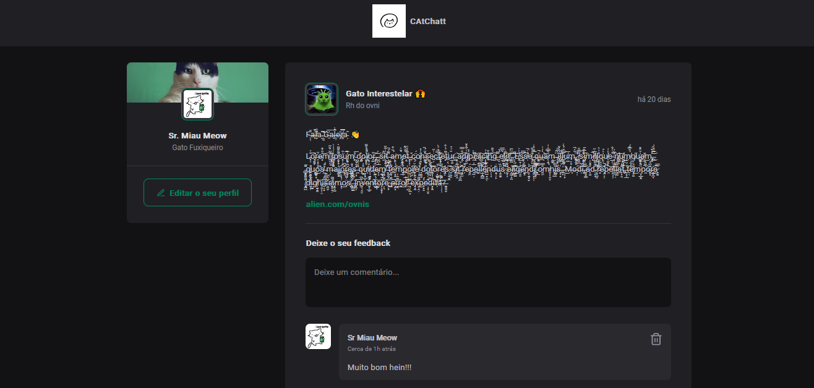

# Catchatt

> Status: Em Desenvolvimento ⚠️

_Leia isso em outro idioma:_
[_Inglês_](./../README.md)

## Sobre o Projeto

Este é um projeto que simula um website para postagens. Foi desenvolvido utilizando JavaScript e a framework React. No site, o usuário pode comentar, curtir comentários e excluir comentários. Outras funcionalidades, como adicionar postagens ou editar perfil, não estão disponíveis no momento.

## Foto de Exemplo

## Em Desenvolvimento

- Funcionalidade de Editar Perfil
- Funcionalidade de Adicionar Post
- Funcionalidade de Excluir Post

## Tecnologias Usadas e Depêndecias

<table>
  <tr>
    <td>Vite</td>
    <td>React</td>
    <td>Javascript</td>
  </tr>
  <tr>
    <td>^5.2.0</td>
    <td>^18.2.0</td>
    <td>^Latest</td>
  </tr>
</table>

## Como Usar

[Clique Aqui](https://eriksgda.github.io/Catchatt-project/) para ir para o website e ver o projeto.

## License

Esse projeto está sob a licença [MIT](./LICENSE).
